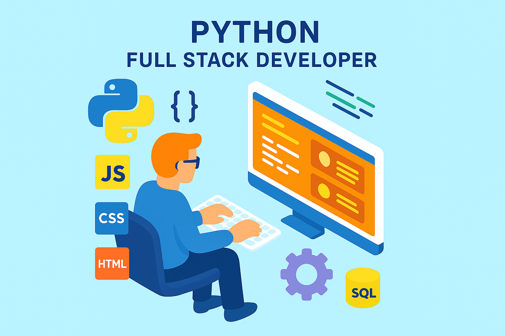

# Hi there, I'm Neha B R 👋

## About Me

I'm a passionate software developer specializing in **full-stack python development** and **data science**. I enjoy building scalable web applications and exploring machine learning models to solve real-world problems.

<!-- - 🔭 I’m currently working on [TaskMaster](https://github.com/NehaRamaswamy/taskmaster) — a productivity app to organize your daily tasks efficiently.-->
- 🌱 I’m learning **DJANGO FRAMEWORK** to improve deployment skills.
- 👯 I’m looking to collaborate on open source projects related to **FULL STACK** and **web development**.
- 💬 Ask me about **JavaScript**, **Python**, **SQL**,**HTML**,**CSS**,**DJANGO**.
- 📫 How to reach me: [nehakoppa080@gmail.com](mailto:nehakoppa080@gmail.com)
- ⚡ Fun fact: I love hiking and photography!
- 🏆 HackerRank Profile: [Check out my work](https://www.hackerrank.com/profile/nehakoppa080)

## Skills

## Projects

### [TaskMaster](https://github.com/NehaRamaswamy/taskmaster)
A productivity web app to help users organize and track their daily tasks. 

---

### [House Price Predictor](https://github.com/NehaRamaswamy/house-price-predictor)
A machine learning model that predicts house prices based on various features using Python and scikit-learn.

---

## GitHub Stats

---

*Thanks for visiting my profile! Feel free to connect with me.*
